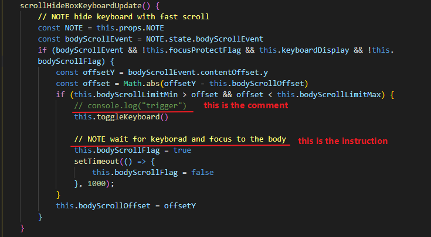

# This is the Mobile Markdown toolbar branch

## Quote

> &emsp;&emsp;I'm still a newbie in[ ](https://github.com/facebook/react-native/issues/18316#issuecomment-561608985)react native actually,All the questions I have mostly just search from Bing and find the solution on github or StackOverflow.    
> &emsp;&emsp;I'm sure some of the code may not follow the react design rule,When I develop the toolbar , I just want to keep the toolbar wroking properly and independently .I'm really sorry about that ,If anybody have any kinds of suggestions,I will appreciate it and try my best to improve my code.
> &emsp;&emsp;The main toolbar code is in the thrid commit of this branch 

---

## Comment 

> &emsp;&emsp;All my comment add the NOTE sign in front of the line,So I can using the [Better Comments](https://marketplace.visualstudio.com/items?itemName=aaron-bond.better-comments) vscode extensions to distinguish between the comment and instruction.




## Selection issue

> &emsp;&emsp;selection modify really had a Bug, I implement the solution form [there](https://github.com/facebook/react-native/issues/18316#issuecomment-561608985)    
> &emsp;&emsp;Basically add the selection change event to the TextInput and clear the selection after state had been updated.

## Feature Description


### Icon Buttons

```js
{
    icon: 'minus',           
    text: '$sel\n---\n',
    iconComponent: (icon, styles) => {
        return <MaterialCommunityIcons name={icon} style={styles} />
    },
    onPress: (text) => {return this.setText2Body(text)}
    onLongPress: (text) => {}
    disabled: true,
    styles: {
        width: 5,
    }
}
```

> &emsp;&emsp;icon button here just a list of the Json describe how the button act.

* buttons settings

        icon          : Icon Name base on the react-native vector icon
        text          : insert text to the note body
        iconComponent : display component
        onPress       : press event
        onLongpress   : long press event
        disabled      : disabled the button press 
        styles        : overwrite the style sheet

* setText2Body 

        :param text    : insert text to the note body - flag: $sel $line $cursor $cursorStart $cursorEnd 
        :type  text    : String
            :flag $sel         : repalce to current selected text if nothing selected move the cursor to there
            :flag $line        : repalce to a single line in the current selected lines loop
            :flag $cursor      : specify position of cursor
            :flag $cursorStart : specify selected start
            :flag $cursorEnd   : specify selected end

        :param options : setText options 
        :type  options : Object {lineCallback, selCallback, selected, modified, selections}
            :param lineCallback : handle $line callback for customization
            :type  lineCallback : Function
            :param selCallback  : handle $sel callback for customization
            :type  selCallback  : Function
            :param selected     : {default:true} false - select nothing after process
            :type  selected     : Bool 
            :param modified     : {default:true} false - only insert text without any process
            :type  modified     : Bool 
            :param selections   : {default:false} specify selection after process
            :type  selections   : Object {start,end} 

> &emsp;&emsp;\$sel  flag for wraped text like `+$sel+`    
> &emsp;&emsp;\$line flag for mark in front of the line like `> $line`   
> &emsp;&emsp;dollar flag using regex for repalcement 

* toggleLineAction 

        :param data    : data from the lineCallback And `regex` for customization
        :type  data    : Object
        :param options : setText options 
        :type  options : Object {toggleCallback, multiline, toggle}
            :param multiline      : {default:true} false - only handle the last selected line
            :type  multiline      : Bool 
            :param toggle         : {default:true} false - disable the toggle action
            :type  toggle         : Bool 
            :param toggleCallback : toggle replacement for customization 
            :type  toggleCallback : Function

> &emsp;&emsp;this function mainly use for setText2Body options {lineCallback}    
> &emsp;&emsp;by default setText2Body $line only handle the last selected line and do not support toggle actions

### Undo Redo 

```js
this.undoWaitSeconds = 2000;                        // NOTE how long push current text body to the undoStack
this.undoWaitFlag = true;                           // NOTE wait flag 
this.undoModifyFlag = false;                        // NOTE modify flag to check current modify , if true then clear the redoStack
this.undoStack = [];                                // NOTE undo data | storage text body and selections Object
this.redoStack = [];                                // NOTE redo data 
this.lastTextBody = this.props.NOTE.state.note.body // NOTE compare the text is Modified or not
```

implement functions
+ undo()
+ redo()
+ undoRedoUpdate()

### Hide Keyboard

```js
this.bodyScrollLimitMin = 80;        // NOTE scroll Min speed
this.bodyScrollLimitMax = 150;       // NOTE scroll Max speed | inside this range scroll speed will auto hide keyboard
this.bodyScrollOffset = 0;           // NOTE last scroll offset value for comparison
this.bodyScrollFlag = false          // NOTE protect flag prevent auto hide keyboard trigger multiple times
this.keyboardDisplay = false         // NOTE Keyboard display check
```

implement functions
+ toggleKeyboard()
+ toggleToolbarBox()